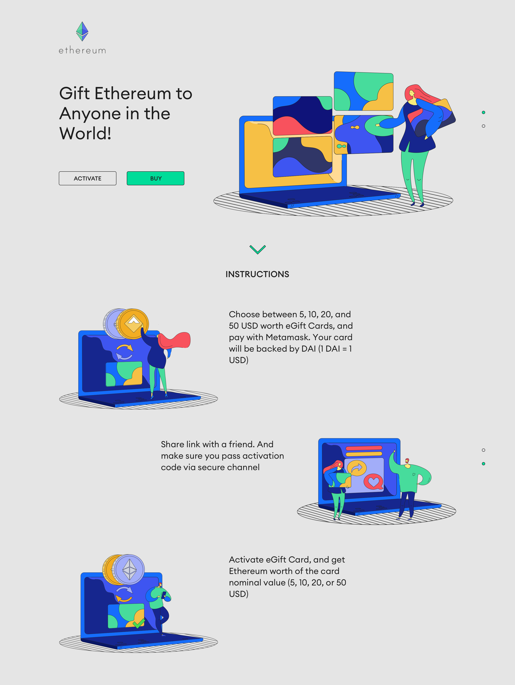

[](https://app.buddy.works/david9105/cryptocards-solidity/pipelines/pipeline/224988)



# Description


# Development

1. Install `truffle` globally with `npm install -g truffle`.
2. Run `git clone https://github.com/phDooY/cryptocards-solidity && cd cryptocards-solidity`
3. Run `npm install` to install dependencies.
4. Configure your `MNEMONIC` and `ENDPOINT` used for deployment in `.env` or sourced in environment variables.

   You may acquire an endpoint URL from [Infura](https://infura.io)
5. Run `truffle console --network ropsten`.
6. Inside the console, run `compile` to compile the contracts.
7. Run `migrate` to deploy the contracts to the Ropsten network.

   You can get free test Ether in order to deploy the contracts from [Ropsten Ethereum Faucet](https://faucet.ropsten.be/).

   Note: It is highly recommended to use `migrate --reset` instead of just `migrate` after making changes to the contracts.
8. Use the cheatsheet below to interact with the contracts.

# Truffle console cheatsheet

Get accounts array and a reference to the deployed contract.

```javascript
a = await web3.eth.getAccounts()
c = await GiftCards.deployed()
```

Example calls:

```javascript
// Call a function. Caller is account 0 by default.
await c.addMaintainer(a[0])
// Call payable function from account 3. Value is in wei.
await c.createCard("some hash", "eleni", "security code hash", {from: a[0], value: 200000000000000000})
// Get card data
d = await c.cards(web3.utils.sha3("some hash"))
// Activate card
await c.activateCard.call(web3.utils.sha3("some hash"), "security code hash", '0x0220A73D5113ED7a85A6B610056573b3FD4968Be')
```


# Useful resources

Exchange wrappers:
https://github.com/DecenterApps/cdpsaver-contracts/tree/9fdc6b2fc100a1b5df676840f8e2d748354f23bc/contracts/exchange/wrappers
